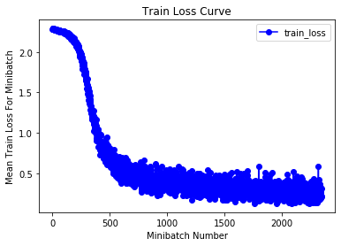
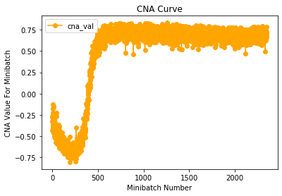
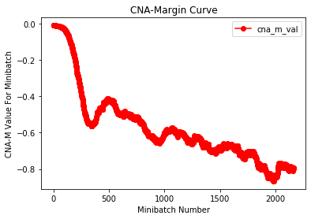
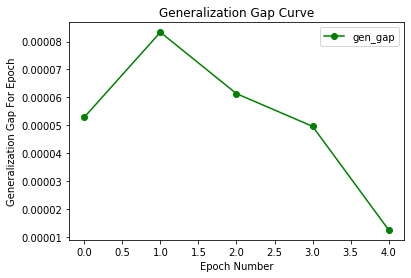

# CNA -- ICML 2020
Official implementation of "Abstraction Mechanisms Predict Generalization in Deep Neural Networks", published in ICML 2020. 
Paper link: https://proceedings.icml.cc/static/paper_files/icml/2020/6109-Paper.pdf

For correspondence and questions: 

Name: Alex Gain 

Email: again1@jhu.edu

LinkedIn: https://www.linkedin.com/in/alex-gain-184305195/

# Fastest Usage
1. Open `CNA_Notebook.ipynb` in Google Collaboratory (https://colab.research.google.com/).
2. At top, click `Runtime -> Run All Cells`.

# Installation, Usage, and Minimal Working Example
1. Add `cna_utils.py` to your root directory.
2. Get dataset loaders and trained network:
```
train_loader, test_loader = get_dataset_loaders() # <-- Your dataset loader method goes here
net = torch.load(SAVED_NET_PATH_HERE) # <--- Loading your saved network
```
3. Getting CNA and CNA-Margin values:
```
from cna_utils import *
cna_val = CNA_all(train_loader, net)
cna_m_val = CNA_M(train_loader, test_loader, net, args.flatten)
```

For minimal working example in `cna-icml2020/usage` run:
`python get_cna.py --net_path saved_nets/net0.pt --dataset mnist --flatten=1 --cuda=1`

# Example Results From `CNA_Notebook.ipynb`






# Legacy code
For posterity, in `cna-icml2020/legacy_code`, the original code for producing the experimental results from the paper is supplied. This is not updated or maintained. All functionality will be refactored into this new repository for more convenient usage. It is recommended to make use of the non-legacy code for future work.

TO-DO left for refactoring legacy code into `get_cna.py`:
- [ ] Shuffled label dataset loaders.
- [ ] Margin-based generalization metrics (can also be accessed here: https://github.com/bneyshabur/generalization-bounds).


